Отчёт об оптимизации FastSearch
======

#### Стартовые значения
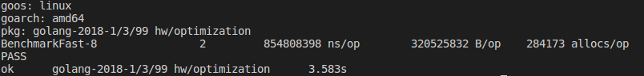

### 1. Regexp 1
------
Нашлась с помощью pprof по cpu
```golang
1.38s     62:
if ok, err := regexp.MatchString("Android", browser); ok && err == nil {
```
#### Замена на 
```golang
if strings.Contains(browser, "Android") {
```
#### Причина
Так как regexp слишком мощный и затратный инструмент для поиска обычной подстроки.
#### Результат
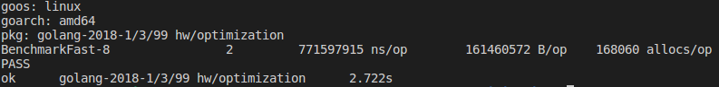

------

### 2. Regexp 2
------
Нашлась и оптимизировалась аналогично
```golang
 1.53s     84:
 if ok, err := regexp.MatchString("MSIE", browser); ok && err == nil {
```
#### Замена на
```golang
if strings.Contains(browser, "MSIE") {
```
#### Причина
Аналогично п. 1
#### Результат
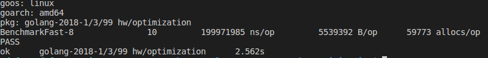

------

### 3. Regexp ReplaceAllString
------
Нашлась с помощью -alloc_objects
```golang
 132     27:
 r := regexp.MustCompile("@")

 4309    105:
 email := r.ReplaceAllString(user["email"].(string), " [at] ")
 ```
#### Замена на
```golang
email := user["email"].(string)
		indx := strings.Index(email, "@")
        foundUsers += fmt.Sprintf("[%d] %s <%s [at] %s>\n", i, user["name"], email[:indx], email[indx+1:])
```
#### Причина
Так как regexp слишком мощный и затратный инструмент для поиска и замены обычной подстроки.
#### Результат
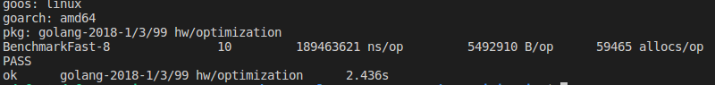

------

### 4. Переход на кастомный json-парсер
------
Нашлась с помощью -alloc_objects + web

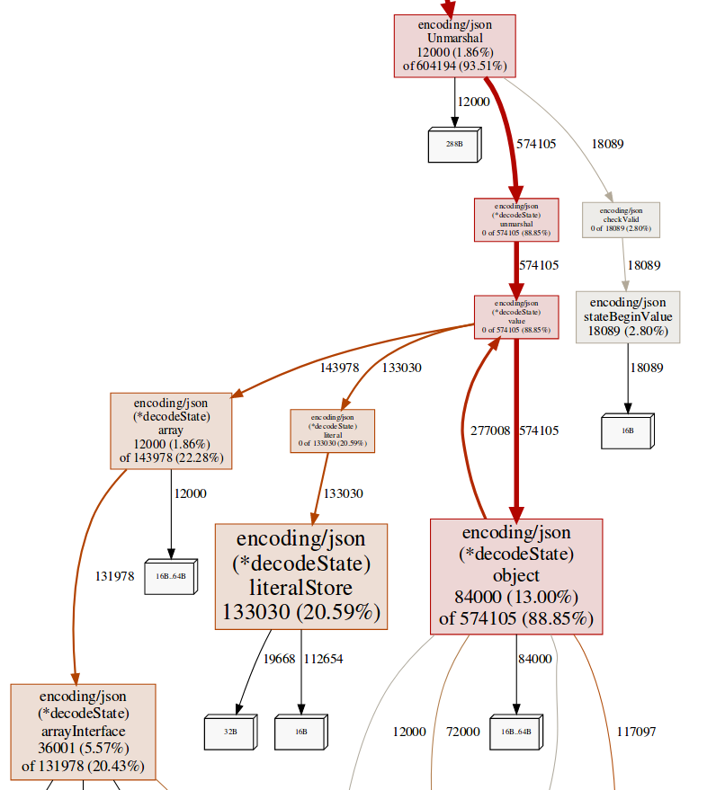

#### Замена на
```golang
type User struct {
	Browsers []string
	Company  string
	Country  string
	Email    string
	Job      string
	Name     string
	Phone    string
}

err := user.UnmarshalJSON(line)
```
#### Причина
Встроенный парсер json работает в 4-5 раз затратнее easyjson.
#### Результат
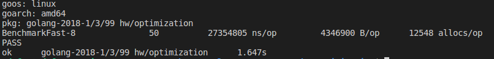

------

### 5. Уход от приведения interface{}
------
Например строка 50:
```golang
browsers, ok := user["browsers"].([]interface{})
		if !ok {
			// log.Println("cant cast browsers")
			continue
		}
 ```
#### Замена на
```golang
for _, browser := range user.Browsers {
```
#### Причина
Из п.4 появилась структура и отпала необходимость использования приведения интерфейса
#### Результат


------

### 6. Накапление ответа в foundUsers + отказ от форматирования
------
Нашлась с помощью -alloc_objects

```golang
24117     98:
foundUsers += fmt.Sprintf("[%d] %s <%s [at] %s>\n", i, user.Name, user.Email[:indx], user.Email[indx+1:])
 ```
#### Замена на
```golang
fmt.Fprintln(out, "[", strconv.Itoa(i), "] ", user.Name, " <", user.Email[:indx], " [at] ", user.Email[indx+1:], ">")
```
#### Причина
Concat строк в цикле приводит к постоянным аллокациям + на разбор выражение Fprintf также требуются дополнительные ресурсы.
#### Результат
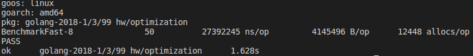

------

### 7. Отказ от считывания файла сразу
------
Нашлась с помощью -alloc_space

```golang
105.40MB     31:
fileContents, err := ioutil.ReadAll(file)
 ```
#### Замена на
```golang
fileReader := bufio.NewReader(file)

line, _, inputErr := fileReader.ReadLine()
if inputErr == io.EOF {
	break
} else if inputErr != nil {
		panic(inputErr)
}
```
#### Причина
Загрузка большого файла полностью в память отрицательно сказывается на производительности + не нужно приводить к слайсу байтов из стринга
#### Результат
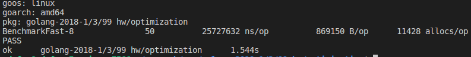

------

### 8. Отказ от слайса users + объединение 2х внешних циклов в 1 + объединение 2х внутренних циклов в 1
------
Нашлась с помощью -alloc_space + -alloc_objects

```golang
12.99MB     53:
users = append(users, user)

572     53:
users = append(users, user)
 ```
#### Замена на
Новый цикл с 37й строки до 95й
И два внутренних соед. с помощью if / else if
#### Причина
Хранение ненужного массива данных + лишние аллокации
#### Результат
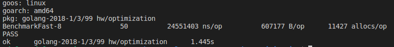

------

### 9. Переход к явной буферизации вывода + отказ от strconv.Itoa
------
Нашлась с помощью -alloc_objects

```golang
3514     90:
fmt.Fprintln(out, "[", i, "] ",
12948    91:
user.Name, " <", user.Email[:indx], " [at] ", user.Email[indx+1:], ">")
 ```
#### Замена на
```golang
writer := bytes.Buffer{}
intBuff := make([]byte, 0, 8)

writer.WriteByte('[')
intBuff = intBuff[:0]
writer.Write(strconv.AppendInt(intBuff, i, 10))
writer.WriteString("] ")
writer.WriteString(user.Name)
writer.WriteString(" <")
writer.WriteString(user.Email[:indx])
writer.WriteString(" [at] ")
writer.WriteString(user.Email[indx+1:])
writer.WriteString(">\n")
writer.WriteTo(out)
```
#### Причина
Явная буферизация позволяет повысить эффективность вывода данных

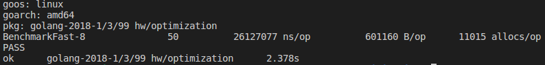

------

### 10. Вынос из цикла создания объекта User
------
Нашлась с помощью -alloc_objects

```golang
41:
user := &User{}
1020215     42:
err := user.UnmarshalJSON(fileScanner.Bytes())
 ```
#### Замена на
```golang
user := &User{}
for fileScanner.Scan() {
```
#### Причина
Нет необходимости постоянно создавать новый объект User.
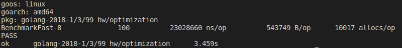

------

### 11. Переход к slice seenBrowsers к map seenBrowsers
------
```golang
for _, item := range seenBrowsers {
		if item == browser {
			notSeenBefore = false
		}
	}
	if notSeenBefore {
		seenBrowsers = append(seenBrowsers, browser)
		uniqueBrowsers++
	}
 ```
#### Замена на
```golang
seenBrowsers[browser] = struct{}{}
```
#### Причина
Лишний цикл

------